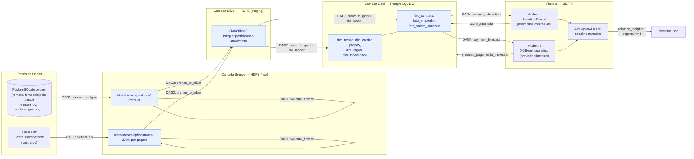
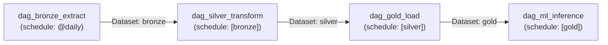

# Arquitetura do Pipeline

Padrão Medallion (Bronze → Silver → Gold), orquestrado pelo Apache Airflow, com camadas
Bronze/Silver em HDFS e camada Gold em um Data Warehouse dimensional PostgreSQL.

## DAGs (Apache Airflow) e encadeamento via Datasets

Cada DAG só é disparada quando a anterior publica seu `Dataset` de saída (data-aware
scheduling do Airflow 2.x) — não há `ExternalTaskSensor` nem acoplamento por horário fixo.

## Componentes de infraestrutura (docker-compose)

| Serviço | Papel |
|---|---|
| `postgres-dw` | Data Warehouse (camada Gold) |
| `postgres-airflow` | Metastore interno do Airflow (não é fonte nem DW) |
| `namenode` / `datanode` | HDFS — camadas Bronze e Silver |
| `airflow-webserver` / `airflow-scheduler` / `airflow-init` | Orquestração |
| `jupyter` | EDA e treinamento dos modelos de ML |

O relatório narrativo (`models/report_generator.py`) chama a **API da OpenAI** diretamente
pela internet — não há container dedicado para isso, o que mantém o stack mais leve.

**Desvio intencional em relação ao enunciado:** o banco "de origem" não é containerizado —
usamos diretamente o PostgreSQL remoto fornecido para o curso
(`srv1236151.hstgr.cloud:5433/dados_publicos`), que já contém dados reais de execução
orçamentária do Ceará. Isso evita duplicar ~1,4 milhão de linhas localmente e mantém o
pipeline testado contra dados reais, não sintéticos.
